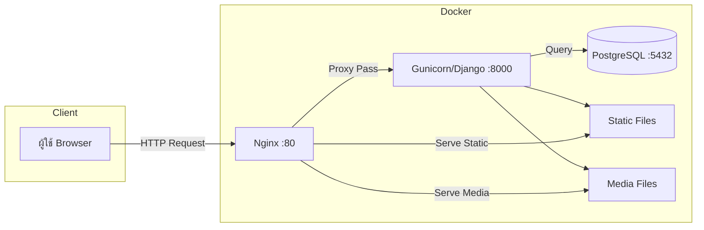
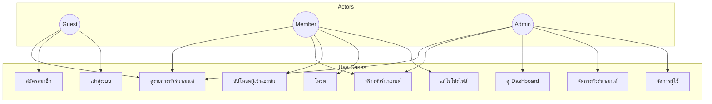
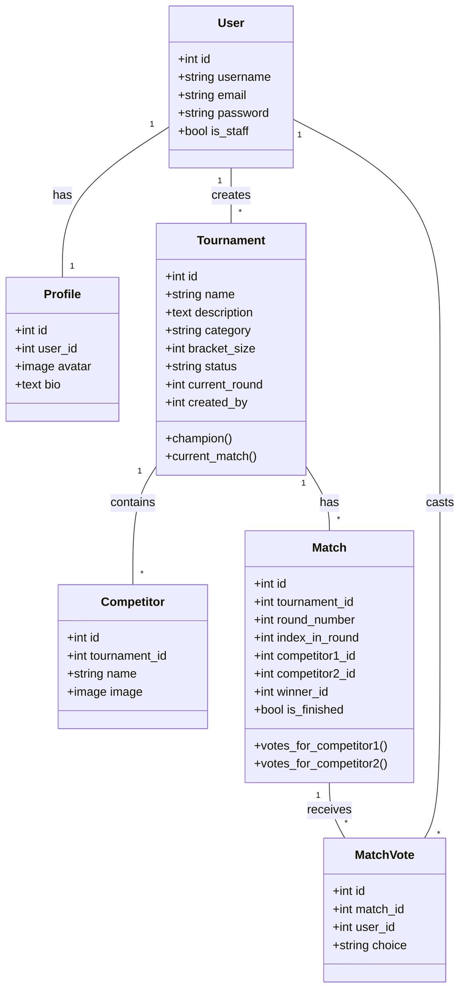
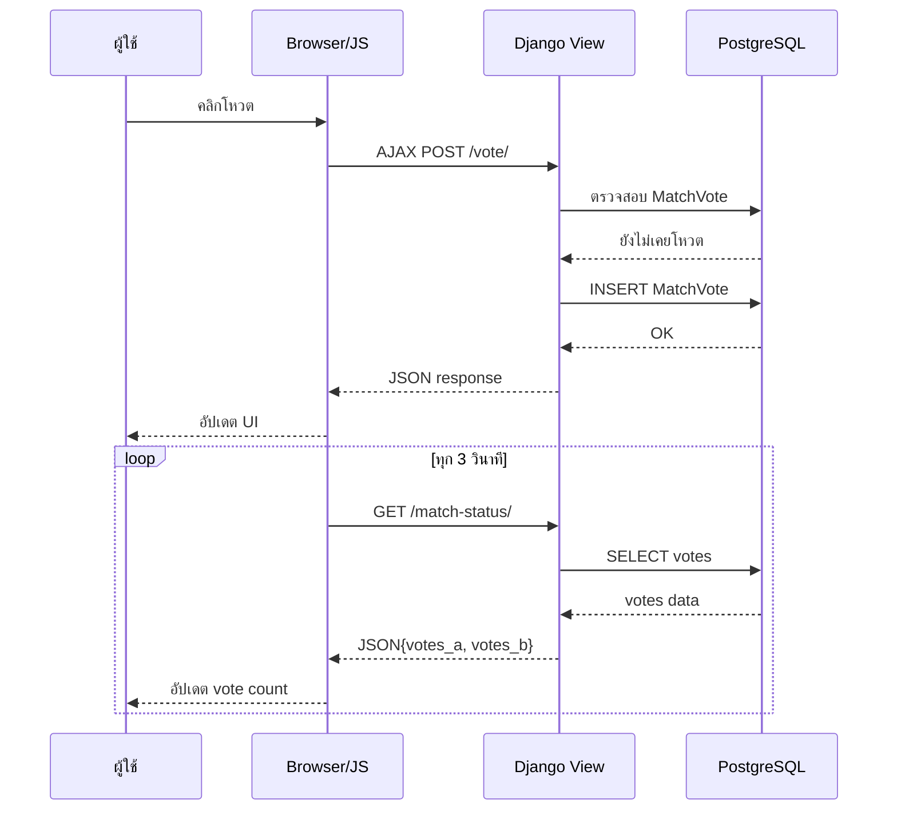
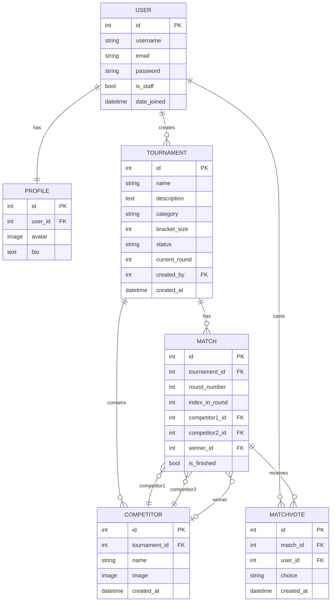

# Mermaid Diagrams สำหรับบทที่ 3

## รูปที่ 3.1 แผนภาพสถาปัตยกรรมระบบ

## รูปที่ 3.3 Use Case Diagram

## รูปที่ 3.4 Class Diagram

## รูปที่ 3.5 Sequence Diagram กระบวนการโหวต

## รูปที่ 3.6 ER Diagram

