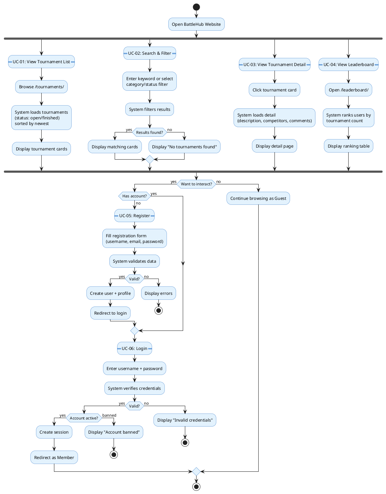
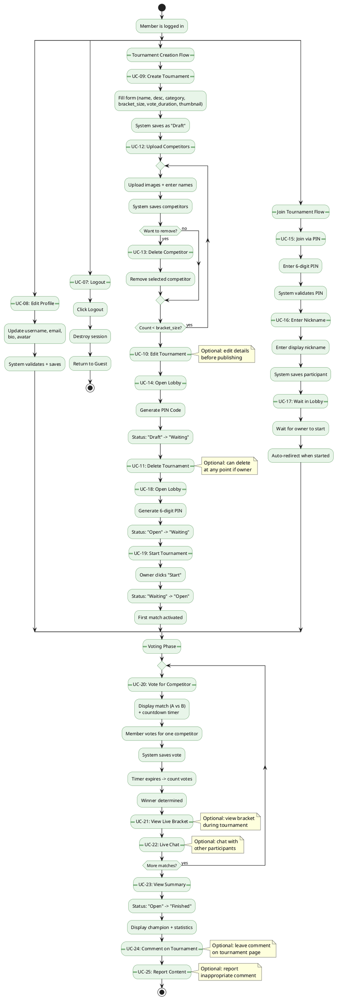
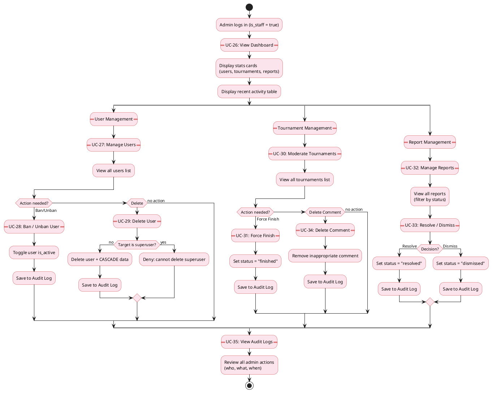

# BattleHub — Activity Diagrams (รวมตามหมวด)

ก็อปทั้ง block ไปวางที่ [plantuml.com](https://www.plantuml.com/plantuml/uml/) ได้เลย — ได้ภาพเดียวต่อหมวด

---

## 1. Activity Diagram: Guest (UC-01 ถึง UC-06)

---

## 2. Activity Diagram: Member (UC-07 ถึง UC-25)

---

## 3. Activity Diagram: Admin (UC-26 ถึง UC-35)

