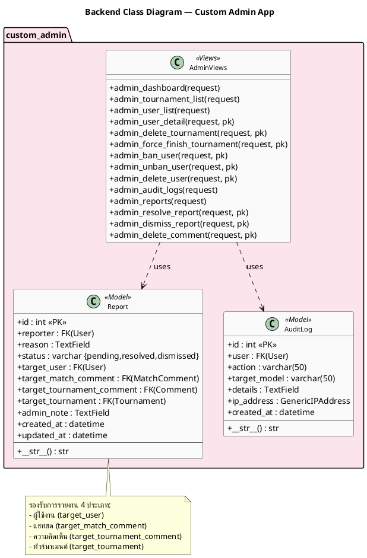
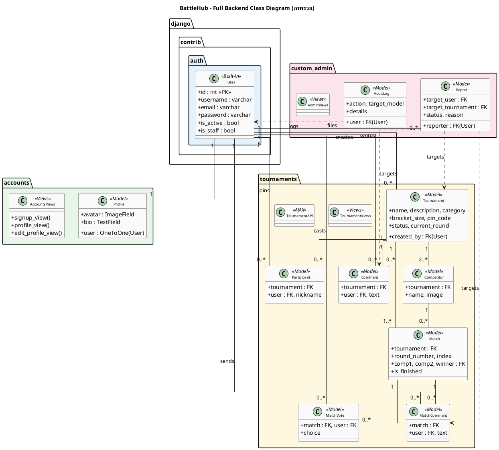
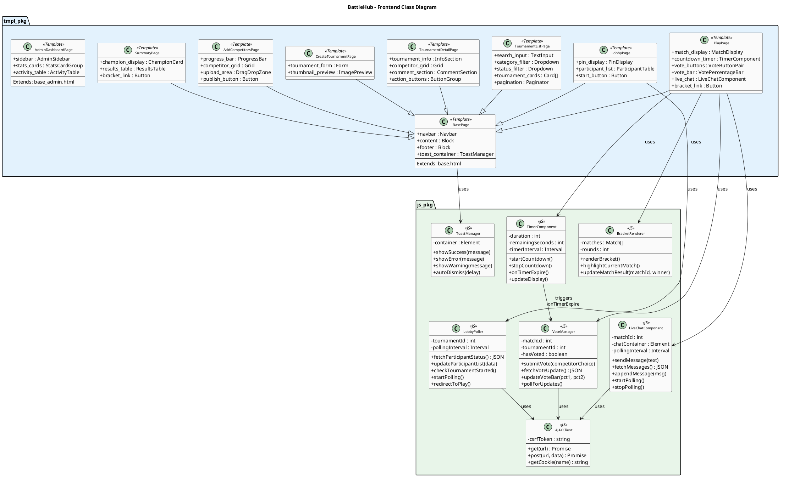

# 3.5 แผนภาพคลาส (Class Diagram)

แผนภาพคลาสของระบบ BattleHub ถูกจัดทำแยกเป็น 2 ส่วน ได้แก่ ฝั่ง Backend (Django Models, Views, Forms) และฝั่ง Frontend (HTML Templates, JavaScript Components)

---

## 3.5.1 Backend Class Diagram

ระบบฝั่ง Backend พัฒนาด้วย Django Framework แบ่งออกเป็น 3 Django App ดังนี้

### 3.5.1.1 Accounts App

รับผิดชอบระบบจัดการบัญชีผู้ใช้งาน ประกอบด้วย
- User (Django Built-in) เก็บข้อมูลบัญชีผู้ใช้ ประกอบด้วย id, username, email, password, is_active (สถานะบัญชี), is_staff (สิทธิ์ผู้ดูแล), date_joined
- Profile เก็บข้อมูลโปรไฟล์เพิ่มเติม ประกอบด้วย id, user (OneToOneField), avatar (ImageField), bio (TextField) มีความสัมพันธ์แบบ One-to-One กับ User ถูกสร้างอัตโนมัติผ่าน Django post_save signal เมื่อสมัครสมาชิก
- CustomSignUpForm สืบทอดจาก UserCreationForm เพิ่มช่อง email สำหรับสมัครสมาชิก
- ProfileUpdateForm ใช้แก้ไข email มี clean_email() ตรวจสอบ email ซ้ำ
- ProfileForm ใช้แก้ไข avatar และ bio
- AccountsViews ประกอบด้วย signup_view (สมัครสมาชิก), profile_view (ดูโปรไฟล์), edit_profile_view (แก้ไขโปรไฟล์)

```plantuml
@startuml CD_Backend_Accounts

skinparam defaultFontName "Tahoma"
skinparam shadowing false
skinparam backgroundColor White
skinparam classAttributeIconSize 0
skinparam class {
    BackgroundColor #FAFAFA
    BorderColor #333333
    FontSize 11
}

title Backend Class Diagram — Accounts App

package "django.contrib.auth" as auth_pkg #E3F2FD {
    class User <<Django Built-in>> {
        + id : int <<PK>>
        + username : varchar(150)
        + email : varchar(254)
        + password : varchar(128)
        + is_active : boolean
        + is_staff : boolean
        + date_joined : datetime
    }
}

package "accounts" as acc_pkg #E8F5E9 {

    class Profile <<Model>> {
        + id : int <<PK>>
        + user : OneToOneField(User)
        + avatar : ImageField
        + bio : TextField(500)
        --
        + __str__() : str
    }

    class CustomSignUpForm <<Form>> {
        + email : EmailField
        --
        + save(commit) : User
    }

    class ProfileUpdateForm <<Form>> {
        + email : EmailField
        --
        + clean_email() : str
    }

    class ProfileForm <<Form>> {
        + avatar : FileInput
        + bio : Textarea
    }

    class AccountsViews <<Views>> {
        + signup_view(request)
        + profile_view(request)
        + edit_profile_view(request)
    }
}

User "1" -- "1" Profile : has >
AccountsViews ..> Profile : uses
AccountsViews ..> CustomSignUpForm : uses
AccountsViews ..> ProfileUpdateForm : uses
AccountsViews ..> ProfileForm : uses
CustomSignUpForm ..> User : creates

@enduml
```

(รูปที่ 3.4 แผนภาพคลาส Backend — Accounts App)

คำอธิบายภาพ: จากภาพที่ 3.4 แสดงแผนภาพคลาสของ Accounts App ซึ่งรับผิดชอบระบบจัดการบัญชีผู้ใช้งาน ประกอบด้วย Model "User" ที่เป็นคลาสพื้นฐานของ Django สำหรับเก็บข้อมูลบัญชี (username, email, password, สิทธิ์) และ Model "Profile" ที่มีความสัมพันธ์แบบ One-to-One กับ User สำหรับเก็บข้อมูลเพิ่มเติม ได้แก่ รูป Avatar และ Bio ฝั่ง Form มี 3 คลาส ได้แก่ CustomSignUpForm สำหรับสมัครสมาชิก (สืบทอดจาก UserCreationForm เพิ่มช่อง email), ProfileUpdateForm สำหรับแก้ไข email และ ProfileForm สำหรับแก้ไข avatar และ bio ทั้งหมดถูกเรียกใช้งานผ่าน AccountsViews ซึ่งมี 3 ฟังก์ชัน ได้แก่ signup_view, profile_view และ edit_profile_view

---

### 3.5.1.2 Tournaments App

เป็น App หลักและใหญ่ที่สุดของระบบ รับผิดชอบฟังก์ชันการทำงานทั้งหมดของทัวร์นาเมนต์ ประกอบด้วย
- Tournament เก็บข้อมูลทัวร์นาเมนต์ ประกอบด้วย id, name, description, category, thumbnail (ImageField), bracket_size (2, 4, 8 หรือ 16), voting_duration_seconds, pin_code (6 หลัก), status (draft, waiting, open, finished), current_round, created_by (FK → User) มีเมธอด total_rounds(), current_match(), is_ready_to_publish(), champion()
- Competitor เก็บข้อมูลผู้เข้าแข่งขัน ประกอบด้วย id, tournament (FK), name, image (ImageField) มีความสัมพันธ์แบบ Many-to-One กับ Tournament
- Match เก็บข้อมูลแมตช์ 1v1 ประกอบด้วย id, tournament (FK), round_number, index_in_round, competitor1 (FK), competitor2 (FK), winner (FK, nullable), is_finished, started_at มีเมธอด votes_for_competitor1(), votes_for_competitor2()
- MatchVote เก็บข้อมูลการโหวต ประกอบด้วย id, match (FK), user (FK), choice ('1' หรือ '2'), created_at มี unique_together constraint (match, user) ป้องกันโหวตซ้ำ แต่อนุญาตให้เปลี่ยนใจได้
- Comment เก็บความคิดเห็นในหน้ารายละเอียด ประกอบด้วย id, tournament (FK), user (FK), text (TextField), created_at
- MatchComment เก็บข้อความแชทสดระหว่างโหวต ประกอบด้วย id, match (FK), user (FK), text (varchar 200), created_at จำกัด 200 ตัวอักษร
- Participant เก็บข้อมูลผู้เข้าร่วม Lobby ประกอบด้วย id, tournament (FK), user (FK, nullable), nickname (varchar 50), session_key, joined_at มี unique_together constraint (tournament, user)
- TournamentForm ใช้สร้างและแก้ไขทัวร์นาเมนต์ (name, description, category, thumbnail, bracket_size, voting_duration_seconds)
- CompetitorForm ใช้อัปโหลดผู้เข้าแข่งขัน (name, image)
- CommentForm ใช้เขียนความคิดเห็น (text)
- TournamentViews จัดการ Server-Side Rendering 14 ฟังก์ชัน ได้แก่ tournament_list, tournament_detail, tournament_create, tournament_update, tournament_delete, add_competitors, delete_competitor, publish_tournament, play, finish_match, summary, bracket_transition, add_comment, leaderboard
- TournamentAPI จัดการ AJAX Endpoint 12 ฟังก์ชัน ได้แก่ vote_update, vote_submit, get_match_comments, post_match_comment, report_match_comment, report_tournament_comment, join_lobby, join_lobby_confirm, waiting_lobby, open_lobby, start_tournament, participant_status

```plantuml
@startuml CD_Backend_Tournaments

skinparam defaultFontName "Tahoma"
skinparam shadowing false
skinparam backgroundColor White
skinparam classAttributeIconSize 0
skinparam class {
    BackgroundColor #FAFAFA
    BorderColor #333333
    FontSize 10
}

title Backend Class Diagram — Tournaments App

package "tournaments" as tour_pkg #FFF8E1 {

    class Tournament <<Model>> {
        + id : int <<PK>>
        + name : varchar(200)
        + description : TextField
        + category : varchar(100)
        + thumbnail : ImageField
        + bracket_size : int {2,4,8,16}
        + voting_duration_seconds : int
        + pin_code : varchar(6)
        + status : varchar {draft,waiting,open,finished}
        + current_round : int
        + created_by : FK(User)
        + created_at : datetime
        --
        + total_rounds() : int
        + current_match() : Match
        + is_ready_to_publish() : bool
        + champion() : Competitor
    }

    class Competitor <<Model>> {
        + id : int <<PK>>
        + tournament : FK(Tournament)
        + name : varchar(200)
        + image : ImageField
        + created_at : datetime
        --
        + __str__() : str
    }

    class Match <<Model>> {
        + id : int <<PK>>
        + tournament : FK(Tournament)
        + round_number : int
        + index_in_round : int
        + competitor1 : FK(Competitor)
        + competitor2 : FK(Competitor)
        + winner : FK(Competitor)
        + is_finished : boolean
        + started_at : datetime
        + created_at : datetime
        --
        + votes_for_competitor1() : int
        + votes_for_competitor2() : int
    }

    class MatchVote <<Model>> {
        + id : int <<PK>>
        + match : FK(Match)
        + user : FK(User)
        + choice : varchar {1,2}
        + created_at : datetime
        --
        <<unique_together: match, user>>
    }

    class Comment <<Model>> {
        + id : int <<PK>>
        + tournament : FK(Tournament)
        + user : FK(User)
        + text : TextField
        + created_at : datetime
    }

    class MatchComment <<Model>> {
        + id : int <<PK>>
        + match : FK(Match)
        + user : FK(User)
        + text : varchar(200)
        + created_at : datetime
    }

    class Participant <<Model>> {
        + id : int <<PK>>
        + tournament : FK(Tournament)
        + user : FK(User)
        + nickname : varchar(50)
        + session_key : varchar(100)
        + joined_at : datetime
        --
        <<unique_together: tournament, user>>
    }

    class TournamentForm <<Form>> {
        + name, description, category
        + thumbnail, bracket_size
        + voting_duration_seconds
    }

    class CompetitorForm <<Form>> {
        + name : TextInput
        + image : FileInput
    }

    class CommentForm <<Form>> {
        + text : Textarea
    }

    class TournamentViews <<Views>> {
        + tournament_list(request)
        + tournament_detail(request, pk)
        + tournament_create(request)
        + tournament_update(request, pk)
        + tournament_delete(request, pk)
        + add_competitors(request, pk)
        + delete_competitor(request, pk, comp_id)
        + publish_tournament(request, pk)
        + play(request, pk)
        + finish_match(request, pk, match_id)
        + summary(request, pk)
        + bracket_transition(request, pk)
        + add_comment(request, pk)
        + leaderboard(request)
    }

    class TournamentAPI <<Views / AJAX>> {
        + vote_update(request, pk) : JSON
        + vote_submit(request, pk) : JSON
        + get_match_comments(request, pk, mid) : JSON
        + post_match_comment(request, pk, mid) : JSON
        + report_match_comment(request, pk, cid) : JSON
        + report_tournament_comment(request, pk, cid) : JSON
        + join_lobby(request) : HTML
        + join_lobby_confirm(request, pk) : HTML
        + waiting_lobby(request, pk) : HTML
        + open_lobby(request, pk)
        + start_tournament(request, pk)
        + participant_status(request, pk) : JSON
    }
}

Tournament "1" -- "2..*" Competitor : contains >
Tournament "1" -- "1..*" Match : has >
Tournament "1" -- "0..*" Comment : has >
Tournament "1" -- "0..*" Participant : joined_by >
Match "1" -- "0..*" MatchVote : receives >
Match "1" -- "0..*" MatchComment : has >
Competitor "1" -- "0..*" Match : participates >

TournamentViews ..> Tournament : uses
TournamentViews ..> TournamentForm : uses
TournamentViews ..> CompetitorForm : uses
TournamentViews ..> CommentForm : uses
TournamentAPI ..> Match : uses
TournamentAPI ..> MatchVote : uses
TournamentAPI ..> Participant : uses

@enduml
```

(รูปที่ 3.5 แผนภาพคลาส Backend — Tournaments App)

คำอธิบายภาพ: จากภาพที่ 3.5 แสดงแผนภาพคลาสของ Tournaments App ซึ่งเป็น App หลักและใหญ่ที่สุดของระบบ รับผิดชอบฟังก์ชันการทำงานทั้งหมดของทัวร์นาเมนต์ ประกอบด้วย Model 7 ตัว ดังนี้ (1) Tournament เก็บข้อมูลทัวร์นาเมนต์ มี 4 สถานะ (draft, waiting, open, finished) และเก็บ PIN 6 หลักสำหรับระบบ Lobby (2) Competitor เก็บข้อมูลผู้เข้าแข่งขัน มีความสัมพันธ์ Many-to-One กับ Tournament (3) Match เก็บข้อมูลแมตช์ 1v1 ประกอบด้วย เลขรอบ ลำดับแมตช์ คู่แข่งขัน และผู้ชนะ (4) MatchVote เก็บคะแนนโหวต มี unique_together constraint ป้องกันโหวตซ้ำ (5) Comment เก็บความคิดเห็นในหน้ารายละเอียดทัวร์นาเมนต์ (6) MatchComment เก็บข้อความแชทสดระหว่างโหวต จำกัด 200 ตัวอักษร (7) Participant เก็บข้อมูลผู้เข้าร่วม Lobby มี nickname และ session_key ฝั่ง Form มี 3 คลาส และฝั่ง Views แบ่งเป็น TournamentViews สำหรับ Server-Side Rendering (14 ฟังก์ชัน) และ TournamentAPI สำหรับ AJAX Endpoint (12 ฟังก์ชัน)

---

### 3.5.1.3 Custom Admin App

รับผิดชอบระบบจัดการสำหรับผู้ดูแลระบบ ประกอบด้วย
- **Report** เก็บข้อมูลการรายงานปัญหา ประกอบด้วย id, reporter (FK → User), reason (TextField), status (pending, resolved, dismissed) รองรับ 4 ประเภทเป้าหมายผ่าน Nullable Foreign Key ได้แก่ target_user, target_match_comment, target_tournament_comment, target_tournament มี admin_note สำหรับบันทึกภายใน created_at และ updated_at
- **AuditLog** เก็บประวัติการดำเนินการของผู้ดูแลระบบ ประกอบด้วย id, user (FK → Admin), action (varchar 50 เช่น BAN, DELETE, FORCE_FINISH), target_model (varchar 50), details (TextField), ip_address (GenericIPAddress), created_at ทุกการกระทำของ Admin จะถูกบันทึกอัตโนมัติเพื่อความโปร่งใสและตรวจสอบย้อนหลังได้
- **AdminViews** ประกอบด้วย 14 ฟังก์ชัน แบ่งเป็น 4 กลุ่มหลัก ได้แก่ (1) Dashboard: admin_dashboard (2) จัดการทัวร์นาเมนต์: admin_tournament_list, admin_delete_tournament, admin_force_finish_tournament (3) จัดการผู้ใช้: admin_user_list, admin_user_detail, admin_ban_user, admin_unban_user, admin_delete_user (4) จัดการรายงาน: admin_reports, admin_resolve_report, admin_dismiss_report, admin_delete_comment, admin_audit_logs ทุกฟังก์ชันถูกป้องกันด้วย @admin_required decorator ที่ตรวจสอบ is_staff = True

(รูปที่ 3.6 แผนภาพคลาส Backend — Custom Admin App)

คำอธิบายภาพ: จากภาพที่ 3.6 แสดงแผนภาพคลาสของ Custom Admin App ซึ่งรับผิดชอบระบบจัดการสำหรับผู้ดูแลระบบ ประกอบด้วย Model 2 ตัว ดังนี้ (1) Report เก็บข้อมูลการรายงานปัญหาจากผู้ใช้งาน รองรับ 4 ประเภทเป้าหมาย ได้แก่ ผู้ใช้งาน แชทสด ความคิดเห็น และทัวร์นาเมนต์ โดยใช้ Nullable Foreign Key เพื่อความยืดหยุ่น มี 3 สถานะ (pending, resolved, dismissed) และช่อง admin_note สำหรับบันทึกภายใน (2) AuditLog เก็บประวัติการดำเนินการของผู้ดูแลระบบทุกครั้ง ประกอบด้วย ผู้ดำเนินการ ประเภทการกระทำ (BAN, DELETE, FORCE_FINISH ฯลฯ) เป้าหมาย รายละเอียด และ IP Address ฝั่ง Views มี AdminViews ที่มี 14 ฟังก์ชัน ครอบคลุมการจัดการผู้ใช้ ทัวร์นาเมนต์ รายงาน และ Audit Log ทุกฟังก์ชันถูกป้องกันด้วย @admin_required decorator ที่ตรวจสอบ is_staff = True

---

### 3.5.1.4 Full Backend Class Diagram (ภาพรวมความเชื่อมโยง)

แผนภาพนี้รวมทุก App เข้าด้วยกัน เพื่อแสดงความเชื่อมโยงข้ามโมดูล โดย **User** จาก `django.contrib.auth` เป็นศูนย์กลางที่เชื่อมต่อกับทุก App มีความสัมพันธ์ One-to-One กับ Profile (accounts), One-to-Many กับ Tournament, MatchVote, Comment, MatchComment, Participant (tournaments) และ Report (custom_admin) ส่วน Report เชื่อมโยงกลับไปยัง Tournament, Comment, MatchComment ผ่าน Nullable Foreign Key ทำให้สามารถรายงานเนื้อหาจากหลายแหล่งได้ AuditLog บันทึกการกระทำของ Admin ที่ส่งผลต่อ Model ต่าง ๆ ข้ามทุก App

(รูปที่ 3.7 แผนภาพคลาส Backend ภาพรวม — แสดงความเชื่อมโยงระหว่าง App)

คำอธิบายภาพ: จากภาพที่ 3.7 แสดงแผนภาพคลาส Backend ภาพรวมที่รวมทุก App เข้าด้วยกัน เพื่อแสดงความเชื่อมโยงข้ามโมดูล User จาก django.contrib.auth เป็นศูนย์กลางที่เชื่อมต่อกับทุก App โดยมีความสัมพันธ์ One-to-One กับ Profile ใน accounts, One-to-Many กับ Tournament, MatchVote, Comment, MatchComment และ Participant ใน tournaments และ One-to-Many กับ Report ใน custom_admin Report ใน custom_admin เชื่อมโยงกลับไปยัง Tournament, Comment และ MatchComment ใน tournaments ผ่าน Nullable Foreign Key ทำให้สามารถรายงานเนื้อหาจากหลายแหล่งได้ AuditLog บันทึกการกระทำของ Admin ที่ส่งผลต่อ Model ต่าง ๆ ข้ามทุก App

---

## 3.5.2 Frontend Class Diagram

ระบบฝั่ง Frontend แบ่งออกเป็น 2 ส่วน ดังนี้

ส่วน Templates (HTML Pages)
- BasePage เป็น Template หลักที่ทุกหน้าสืบทอด ประกอบด้วย Navbar, Content Block, Footer และ Toast Container
- TournamentListPage หน้ารายการทัวร์นาเมนต์ มีช่องค้นหา ตัวกรองหมวดหมู่ ตัวกรองสถานะ และ Pagination
- TournamentDetailPage หน้ารายละเอียด แสดงข้อมูลทัวร์นาเมนต์ ตารางผู้เข้าแข่งขัน และส่วนความคิดเห็น
- CreateTournamentPage หน้าสร้างทัวร์นาเมนต์ มี Form และ Preview รูปปก
- AddCompetitorsPage หน้าอัปโหลดผู้เข้าแข่งขัน มี Progress Bar, Upload Area และปุ่ม Publish
- PlayPage หน้าโหวต เป็นหน้าที่ซับซ้อนที่สุด ใช้ JavaScript Component 4 ตัว ได้แก่ TimerComponent, VoteManager, LiveChatComponent, BracketRenderer
- LobbyPage หน้าห้องพักรอ แสดง PIN, รายชื่อผู้เข้าร่วม และปุ่มเริ่มแข่ง
- SummaryPage หน้าสรุปผล แสดงผู้ชนะเลิศและตารางผลทุกแมตช์
- AdminDashboardPage หน้าแดชบอร์ดผู้ดูแลระบบ ใช้ Template แยก (base_admin.html) มี Sidebar, Stats Cards และ Activity Table

ส่วน JavaScript Components
- TimerComponent จัดการตัวนับเวลาถอยหลัง มีเมธอด startCountdown(), stopCountdown(), onTimerExpire(), updateDisplay()
- VoteManager จัดการการลงคะแนนและอัปเดตแถบเปอร์เซ็นต์แบบ Real-time มีเมธอด submitVote(), fetchVoteUpdate(), updateVoteBar(), pollForUpdates()
- LiveChatComponent จัดการแชทสดระหว่างโหวต มีเมธอด sendMessage(), fetchMessages(), appendMessage(), startPolling(), stopPolling()
- LobbyPoller ตรวจสอบสถานะห้องพักรอทุก 3 วินาที มีเมธอด fetchParticipantStatus(), updateParticipantList(), checkTournamentStarted(), redirectToPlay()
- AJAXClient คลาสกลางสำหรับเรียก API ผ่าน HTTP มีเมธอด get(), post(), getCookie() จัดการ CSRF Token อัตโนมัติ
- ToastManager จัดการข้อความแจ้งเตือนแบบ Pop-up มีเมธอด showSuccess(), showError(), showWarning(), autoDismiss()
- BracketRenderer วาดสายการแข่งขันในรูปแบบแผนผัง Tournament Bracket มีเมธอด renderBracket(), highlightCurrentMatch(), updateMatchResult()

ทุก Component ที่สื่อสารกับ Backend ใช้ AJAXClient เป็นตัวกลาง TimerComponent มีความสัมพันธ์เชิง Trigger กับ VoteManager เมื่อเวลาหมดลง

(รูปที่ 3.8 แผนภาพคลาส Frontend)

คำอธิบายภาพ: จากภาพที่ 3.8 แสดงแผนภาพคลาสฝั่ง Frontend ของระบบ BattleHub โดยแบ่งออกเป็น 2 Package หลัก ดังนี้ Package "Templates" ประกอบด้วย 9 คลาสที่แทนหน้าจอ HTML หลัก ทุกหน้าสืบทอด (Inherit) จาก BasePage ซึ่งกำหนดโครงสร้างพื้นฐาน ได้แก่ Navbar, Content Block, Footer และ Toast Container ยกเว้น AdminDashboardPage ที่ใช้ Template แยกต่างหาก (base_admin.html) หน้าที่ซับซ้อนที่สุดคือ PlayPage ที่ใช้ JavaScript Component ถึง 4 ตัว Package "JavaScript Components" ประกอบด้วย 7 คลาส ได้แก่ TimerComponent จัดการตัวนับเวลาถอยหลังและเรียก onTimerExpire เมื่อหมดเวลา, VoteManager จัดการการลงคะแนนและอัปเดตแถบเปอร์เซ็นต์แบบ Real-time, LiveChatComponent จัดการแชทสดด้วย Polling ทุก 2 วินาที, LobbyPoller ตรวจสอบสถานะห้องพักรอทุก 3 วินาที, AJAXClient เป็นคลาสกลางสำหรับเรียก API ผ่าน HTTP, ToastManager จัดการข้อความแจ้งเตือนแบบ Pop-up และ BracketRenderer วาดสายการแข่งขันในรูปแบบแผนผัง ทุกคลาสที่สื่อสารกับ Backend ใช้ AJAXClient เป็นตัวกลาง โดย TimerComponent มีความสัมพันธ์เชิง Trigger กับ VoteManager เมื่อเวลาหมดลง
