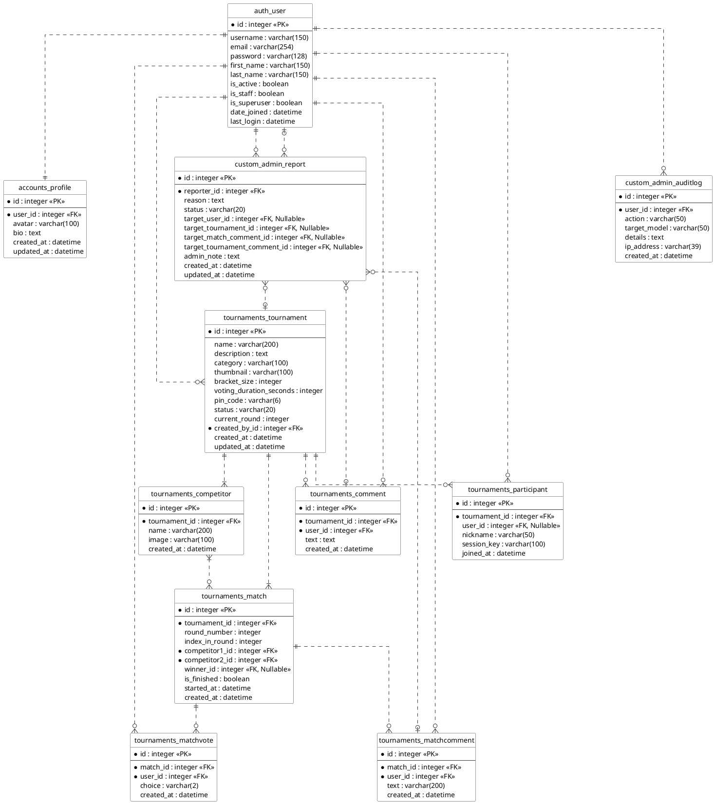

# 3.7 แบบจำลองข้อมูล (Data Model)

แบบจำลองข้อมูลแสดงโครงสร้างการจัดเก็บข้อมูลในระบบจัดการฐานข้อมูล (Database Schema) โดยระบบ BattleHub ใช้ฐานข้อมูลเชิงสัมพันธ์ (Relational Database) ในการจัดเก็บข้อมูล ซึ่งประกอบด้วยตาราง (Entities) และความสัมพันธ์ (Relationships) ดังแสดงในแผนภาพ Entity Relationship Diagram (ERD)

---

## 3.7.1 Entity Relationship Diagram (ERD)

(รูปที่ 3.12 แผนภาพความสัมพันธ์ของข้อมูล Entity Relationship Diagram)

คำอธิบายแผนภาพ:
จากภาพที่ 3.12 แสดงโครงสร้างความสัมพันธ์ของตารางในฐานข้อมูล โดยมีตาราง `auth_user` เป็นศูนย์กลาง เชื่อมโยงกับตารางอื่น ๆ ดังนี้:
1.  **Users & Profiles**: `auth_user` มีความสัมพันธ์แบบ One-to-One กับ `accounts_profile` เพื่อเก็บข้อมูลเพิ่มเติมของผู้ใช้
2.  **Tournaments System**:
    *   `tournaments_tournament` ถูกสร้างโดย User และประกอบด้วย `tournaments_competitor` (ผู้เข้าแข่งขัน)
    *   `tournaments_match` เก็บข้อมูลการจับคู่แข่งขัน เชื่อมโยงกับ Competitor 2 คน (คู่แข่ง) และ 1 คน (ผู้ชนะ)
    *   `tournaments_matchvote` เก็บคะแนนโหวต เชื่อมโยง User กับ Match (User 1 คน โหวตได้ 1 ครั้งต่อ Match)
    *   `tournaments_participant` เก็บข้อมูลผู้เข้าร่วม Lobby
3.  **Social Interactions**:
    *   `tournaments_comment` เก็บความคิดเห็นในทัวร์นาเมนต์
    *   `tournaments_matchcomment` เก็บแชทสดในแมตช์
4.  **Admin & Moderation**:
    *   `custom_admin_report` เก็บข้อมูลการรายงาน เชื่อมโยงกับ User (ผู้แจ้ง) และเป้าหมายปลายทาง (User, Tournament, Comment, Chat) ผ่าน Nullable Foreign Keys
    *   `custom_admin_auditlog` บันทึกประวัติการกระทำของผู้ดูแลระบบ

---

## 3.7.2 พจนานุกรมข้อมูล (Data Dictionary)

รายละเอียดโครงสร้างตาราง (Table Schema) ของระบบ BattleHub มีดังนี้

### 1. ตาราง auth_user (Users)
ตารางจัดเก็บข้อมูลบัญชีผู้ใช้งานระบบ (Default Django User Model)

| Field Name | Data Type | Key | Description |
| :--- | :--- | :--- | :--- |
| id | Integer | PK | รหัสประจำตัวผู้ใช้งาน (Auto Increment) |
| username | Varchar(150) | UQ | ชื่อผู้ใช้งาน (Unique) |
| email | Varchar(254) | | อีเมลผู้ใช้งาน |
| password | Varchar(128) | | รหัสผ่าน (Hashed) |
| is_active | Boolean | | สถานะบัญชี (True=ปกติ, False=ระงับการใช้งาน) |
| is_staff | Boolean | | สิทธิ์ผู้ดูแลระบบ (True=Admin) |
| date_joined | Datetime | | วันที่สมัครสมาชิก |

### 2. ตาราง tournaments_tournament (Tournaments)
ตารางจัดเก็บข้อมูลทัวร์นาเมนต์

| Field Name | Data Type | Key | Description |
| :--- | :--- | :--- | :--- |
| id | Integer | PK | รหัสทัวร์นาเมนต์ |
| name | Varchar(200) | | ชื่อทัวร์นาเมนต์ |
| category | Varchar(100) | | หมวดหมู่ (Anime, Game, etc.) |
| bracket_size | Integer | | จำนวนผู้เข้าแข่งขัน (2, 4, 8, 16) |
| status | Varchar(20) | | สถานะ (draft, waiting, open, finished) |
| pinning_code | Varchar(6) | | รหัส PIN 6 หลักสำหรับเข้าร่วม Lobby |
| created_by_id | Integer | FK | รหัสผู้สร้างทัวร์นาเมนต์ (Ref: auth_user) |
| created_at | Datetime | | วันที่สร้าง |

### 3. ตาราง tournaments_match (Matches)
ตารางจัดเก็บข้อมูลแมตช์การแข่งขัน

| Field Name | Data Type | Key | Description |
| :--- | :--- | :--- | :--- |
| id | Integer | PK | รหัสแมตช์ |
| tournament_id | Integer | FK | รหัสทัวร์นาเมนต์ (Ref: tournaments_tournament) |
| round_number | Integer | | รอบที่แข่งขัน (1, 2, 3...) |
| index_in_round | Integer | | ลำดับแมตช์ในรอบนั้น |
| competitor1_id | Integer | FK | ผู้เข้าแข่งขันฝ่ายที่ 1 (Ref: tournaments_competitor) |
| competitor2_id | Integer | FK | ผู้เข้าแข่งขันฝ่ายที่ 2 (Ref: tournaments_competitor) |
| winner_id | Integer | FK | ผู้ชนะในแมตช์นั้น (Nullable) |
| is_finished | Boolean | | สถานะจบการแข่งขัน |

*(เนื้อหาตารางอื่น ๆ ละไว้ในฐานที่เข้าใจ หรือสามารถเพิ่มเติมได้ตามต้องการ)*
