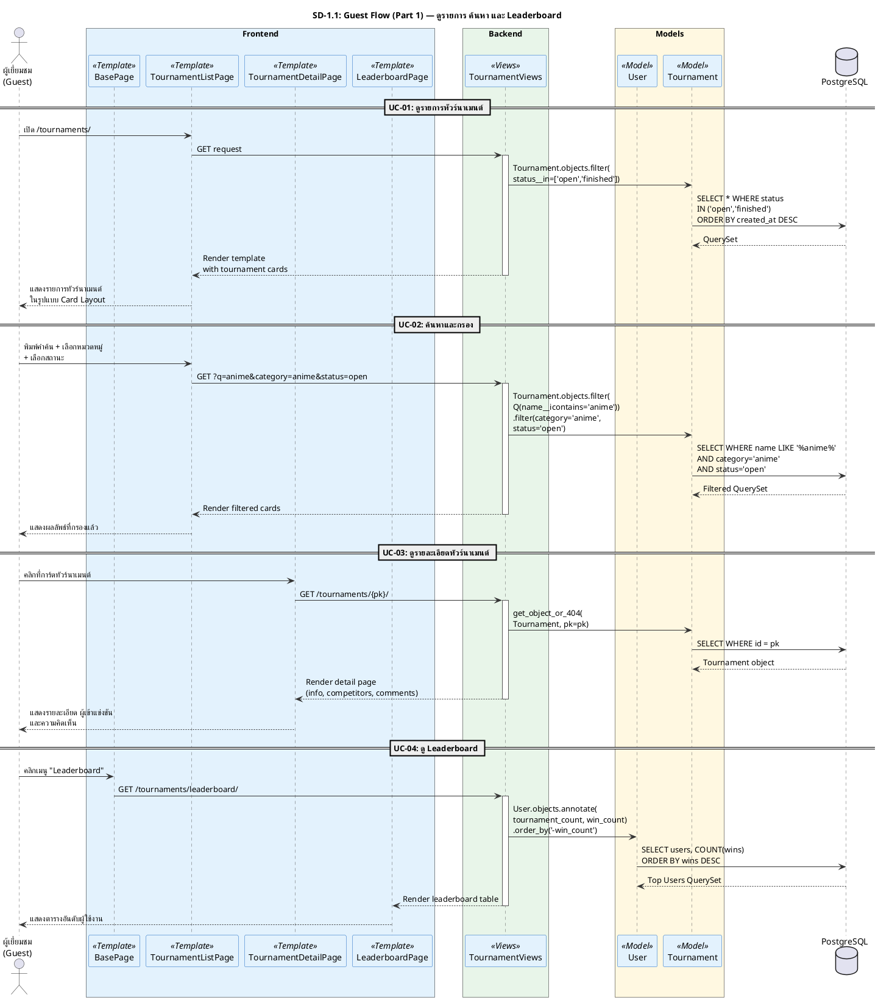
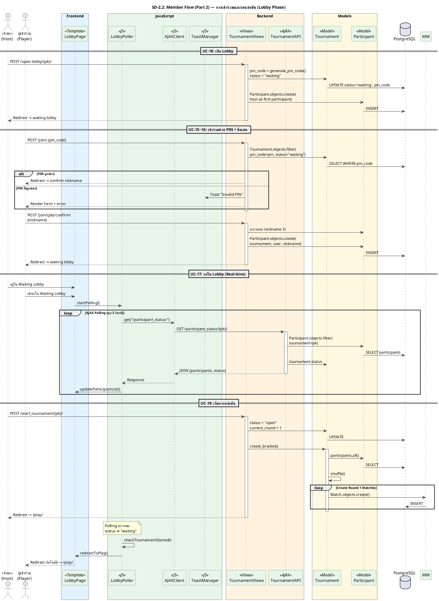
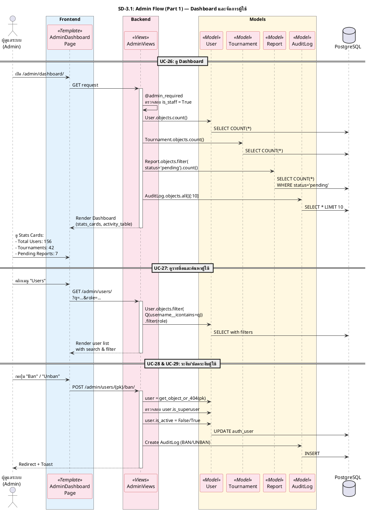
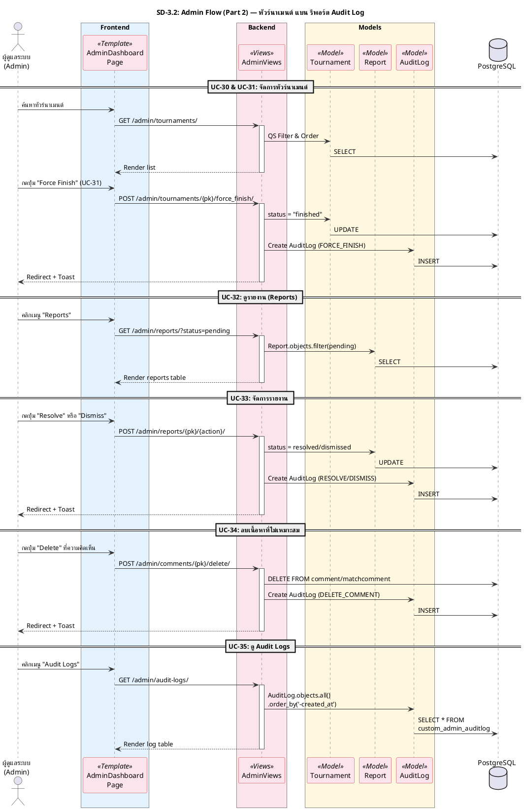

# 3.6 แผนภาพลำดับ (Sequence Diagram)

แผนภาพลำดับของระบบ BattleHub แสดงลำดับขั้นตอนการทำงานของระบบเมื่อผู้ใช้งานดำเนินกิจกรรมต่าง ๆ โดยแบ่งตามบทบาทของผู้ใช้งาน 3 กลุ่ม ได้แก่ ผู้เยี่ยมชม (Guest), สมาชิก (Member) และผู้ดูแลระบบ (Admin) เพื่อให้การนำเสนอมีความชัดเจนและไม่ซับซ้อนจนเกินไป จึงได้แบ่งแผนภาพออกเป็นส่วนย่อยตามกลุ่มฟังก์ชันการทำงาน

---

## 3.6.1 Sequence Diagram ส่วนผู้ใช้งานทั่วไป (Guest Flow)

แบ่งการทำงานออกเป็น 2 ส่วน คือ ส่วนการเข้าถึงข้อมูล (Browsing) และส่วนการยืนยันตัวตน (Authentication)

### 3.6.1.1 ส่วนการเข้าถึงข้อมูล (Browsing)

แสดงขั้นตอนการดูรายการทัวร์นาเมนต์ การค้นหา การดูรายละเอียด และการดูตารางอันดับ

(รูปที่ 3.X Sequence Diagram ส่วนผู้ใช้งานทั่วไป - Part 1 การเข้าถึงข้อมูล)

คำอธิบายภาพ: จากภาพที่ 3.X แสดง Sequence Diagram ส่วนผู้ใช้งานทั่วไป (Guest Flow Part 1) ครอบคลุมการใช้งานพื้นฐานที่ไม่ต้องเข้าสู่ระบบ ได้แก่ การดูรายการทัวร์นาเมนต์ (UC-01) การค้นหาและกรองข้อมูล (UC-02) การดูรายละเอียดทัวร์นาเมนต์ (UC-03) และการดู Leaderboard (UC-04) ซึ่งทั้งหมดเป็นการดึงข้อมูล (GET Request) จากฐานข้อมูลมาแสดงผล

### 3.6.1.2 ส่วนการยืนยันตัวตน (Authentication)

แสดงขั้นตอนการสมัครสมาชิกและการเข้าสู่ระบบ

```plantuml
@startuml SD_Guest_Auth

skinparam defaultFontName "Tahoma"
skinparam shadowing false
skinparam backgroundColor White
skinparam sequence {
    ArrowColor #333333
    LifeLineBorderColor #555555
    ParticipantBackgroundColor #E3F2FD
    ParticipantBorderColor #1565C0
}

title SD-1.2: Guest Flow (Part 2) — สมัครสมาชิก และ เข้าสู่ระบบ

actor "ผู้เยี่ยมชม\n(Guest)" as G

box "Frontend" #E3F2FD
    participant "BasePage" as BP <<Template>>
    participant "TournamentListPage" as TLP <<Template>>
end box

box "Backend" #E8F5E9
    participant "AccountsViews" as AV <<Views>>
    participant "CustomSignUpForm" as CSF <<Form>>
end box

box "Models" #FFF8E1
    participant "User" as UM <<Model>>
    participant "Profile" as PM <<Model>>
end box

database "PostgreSQL" as DB

== UC-05: สมัครสมาชิก ==

G -> BP : เปิด /accounts/register/
BP -> AV : GET request
AV --> BP : Render signup form

G -> BP : กรอก username, email,\npassword, confirm password
BP -> AV : POST (form data)

activate AV
    AV -> CSF : CustomSignUpForm(POST)
    activate CSF
        CSF -> CSF : is_valid()\nตรวจสอบ username ซ้ำ\nตรวจสอบ password strength
        CSF -> UM : User.objects.create_user(\nusername, email, password)
        UM -> DB : INSERT INTO auth_user
        DB --> UM : User created
        CSF -> UM : user.email = cleaned_data['email']
        CSF -> UM : user.save()
    deactivate CSF

    note over PM : Django post_save signal\nสร้าง Profile อัตโนมัติ
    UM -> PM : Profile.objects.create(\nuser=user)
    PM -> DB : INSERT INTO accounts_profile

    AV -> AV : login(request, user)\nสร้าง Session
    AV --> G : Redirect → /tournaments/
deactivate AV

G -> TLP : เข้าสู่หน้ารายการ\nในสถานะสมาชิก

== UC-06: เข้าสู่ระบบ ==

G -> BP : เปิด /accounts/login/
BP -> AV : GET request
AV --> BP : Render login form

G -> BP : กรอก username + password
BP -> AV : POST (username, password)

activate AV
    AV -> UM : authenticate(\nusername, password)
    UM -> DB : SELECT FROM auth_user\nWHERE username = ?
    DB --> UM : User object
    UM -> UM : check_password()\nเปรียบเทียบ hash

    alt ข้อมูลถูกต้อง + is_active = True
        AV -> AV : login(request, user)\nสร้าง Session ID
        AV --> G : Redirect → /tournaments/
        G -> TLP : แสดงหน้ารายการ\n(Navbar: Profile, Logout)
    else ข้อมูลไม่ถูกต้อง
        AV --> BP : แสดงข้อความ\n"Invalid username or password"
    else บัญชีถูกระงับ
        AV --> BP : แสดงข้อความ\n"Account has been suspended"
    end
deactivate AV

@enduml
```

(รูปที่ 3.X Sequence Diagram ส่วนผู้ใช้งานทั่วไป - Part 2 การยืนยันตัวตน)

คำอธิบายภาพ: จากภาพที่ 3.X แสดง Sequence Diagram ส่วนผู้ใช้งานทั่วไป (Guest Flow Part 2) เน้นกระบวนการยืนยันตัวตน เริ่มจากการสมัครสมาชิก (UC-05) ที่มีการสร้าง User และ Profile อัตโนมัติผ่าน Django Signal และการเข้าสู่ระบบ (UC-06) ที่มีการตรวจสอบความถูกต้องของรหัสผ่านและสถานะบัญชี (is_active)

---

## 3.6.2 Sequence Diagram ส่วนสมาชิก (Member Flow) ⭐

เนื่องจากกระบวนการทำงานของสมาชิกมีความซับซ้อนและมีรายละเอียดจำนวนมาก จึงแบ่งการนำเสนอออกเป็น 2 ส่วน คือ ส่วนการจัดการทัวร์นาเมนต์ (Management) และส่วนการแข่งขัน (Gameplay)

### 3.6.2.1 ส่วนการจัดการทัวร์นาเมนต์ (Management)

แสดงลำดับขั้นตอนตั้งแต่การสร้างทัวร์นาเมนต์ การแก้ไข การจัดการผู้เข้าแข่งขัน และการเผยแพร่ (Publish)

```plantuml
@startuml SD_Member_Manage

skinparam defaultFontName "Tahoma"
skinparam shadowing false
skinparam backgroundColor White
skinparam sequence {
    ArrowColor #333333
    LifeLineBorderColor #555555
    ParticipantBackgroundColor #E8F5E9
    ParticipantBorderColor #2E7D32
}

title SD-2.1: Member Flow (Part 1) — การจัดการทัวร์นาเมนต์ (Create, Edit, Publish)

actor "เจ้าของ\n(Host)" as H

box "Frontend" #E3F2FD
    participant "CreateTournament\nPage" as CTP <<Template>>
    participant "AddCompetitors\nPage" as ACP <<Template>>
    participant "TournamentDetail\nPage" as TDP <<Template>>
end box

box "Backend" #FFF3E0
    participant "TournamentViews" as TV <<Views>>
    participant "TournamentForm" as TF <<Form>>
    participant "CompetitorForm" as CF <<Form>>
end box

box "Models" #FFF8E1
    participant "Tournament" as TM <<Model>>
    participant "Competitor" as CM <<Model>>
    participant "Match" as MM <<Model>>
end box

database "PostgreSQL" as DB

== UC-09: สร้างทัวร์นาเมนต์ ==

H -> CTP : เปิด /tournaments/create/
CTP -> TV : GET request
TV --> CTP : Render TournamentForm

H -> CTP : กรอกข้อมูล + อัปโหลดรูปปก
CTP -> TV : POST (multipart)

activate TV
    TV -> TF : TournamentForm(POST, FILES)
    TF -> TF : is_valid()
    TV -> TM : tournament = form.save(\ncommit=False)
    TV -> TM : created_by = request.user\nstatus = "draft"
    TM -> DB : INSERT INTO\ntournaments_tournament
    DB --> TM : Created (pk)
    TV --> H : Redirect → add_competitors
deactivate TV

== UC-10: แก้ไขทัวร์นาเมนต์ ==

H -> CTP : แก้ไขข้อมูล (Edit)
CTP -> TV : POST /tournaments/{pk}/edit/
activate TV
    TV -> TM : get_object_or_404(pk)
    TV -> TF : TournamentForm(POST, instance=tm)
    TF -> TM : form.save()
    TM -> DB : UPDATE tournaments_tournament
    TV --> TDP : Redirect -> Detail Page
deactivate TV

== UC-11: ลบทัวร์นาเมนต์ ==

H -> TDP : กดปุ่ม "Delete"
TDP -> TV : POST /tournaments/{pk}/delete/
activate TV
    TV -> TM : tournament.delete()
    TM -> DB : DELETE FROM tournaments_tournament
    TV --> H : Redirect → tournament list
deactivate TV

== UC-12: อัปโหลดผู้เข้าแข่งขัน ==

H -> ACP : หน้าอัปโหลดผู้เข้าแข่งขัน
loop ทำซ้ำจนครบ bracket_size
    H -> ACP : อัปโหลดรูป + ชื่อ
    ACP -> TV : POST (multipart)
    activate TV
        TV -> CF : CompetitorForm(POST, FILES)
        CF -> CF : is_valid()
        TV -> CM : Competitor.objects.create(\ntournament, name, image)
        CM -> DB : INSERT + save image
    deactivate TV
    TV --> ACP : Render updated list\n+ Progress Bar
end

== UC-13: ลบผู้เข้าแข่งขัน ==

H -> ACP : กดลบผู้เข้าแข่งขัน
ACP -> TV : POST /competitor/{id}/delete/
activate TV
    TV -> CM : competitor.delete()
    CM -> DB : DELETE FROM tournaments_competitor
    TV --> ACP : Redirect back
deactivate TV

== UC-14: Publish Tournament ==

H -> ACP : กดปุ่ม "Open Waiting Lobby"
ACP -> TV : POST /tournaments/{pk}/open_lobby/
activate TV
    TV -> TM : check_ready_to_publish() ✓
    TV -> TM : generate_pin()
    TM -> DB : UPDATE status="waiting", pin="XXXXXX"
    TV --> H : Redirect → Lobby Page
deactivate TV
ACP --> H : แสดงหน้า Lobby (PIN code)

@enduml
```

(รูปที่ 3.X Sequence Diagram ส่วนสมาชิก - Part 1 การจัดการทัวร์นาเมนต์)

คำอธิบายภาพ: จากภาพที่ 3.X แสดง Sequence Diagram ส่วนสมาชิก (Member Flow Part 1) เน้นกระบวนการจัดการทัวร์นาเมนต์ เริ่มตั้งแต่การสร้างทัวร์นาเมนต์ (UC-09) ซึ่งสถานะเริ่มต้นจะเป็น "Draft" ผู้ใช้งานสามารถแก้ไข (UC-10) หรือลบ (UC-11) ทัวร์นาเมนต์ได้ ต่อมาคือขั้นตอนการจัดการผู้เข้าแข่งขัน (UC-12, UC-13) ซึ่งต้องอัปโหลดให้ครบตามจำนวน Bracket Size สุดท้ายคือการเปิดล็อบบี้ (Open Lobby / UC-14) เพื่อเตรียมความพร้อมก่อนเริ่มการแข่งขัน โดยระบบจะสร้าง PIN code และเปลี่ยนสถานะทัวร์นาเมนต์เป็น "Waiting"

### 3.6.2.2 ส่วนการเข้าร่วมและรอแข่งขัน (Lobby Phase)

แสดงลำดับขั้นตอนการเปิดห้อง Lobby การเข้าร่วมด้วย PIN และการรอในห้องพัก (Waiting Room)

(รูปที่ 3.X Sequence Diagram ส่วนสมาชิก - Part 2 การเข้าร่วมและรอแข่งขัน)

คำอธิบายภาพ: จากภาพที่ 3.X แสดง Sequence Diagram ส่วนสมาชิก (Lobby Phase) เริ่มจากการเปิด Lobby (UC-18) และการเข้าร่วมของสมาชิก (UC-15, UC-16) ที่มีการใช้ PIN Code และชื่อเล่น ระบบ Waiting Lobby (UC-17) ใช้ AJAX Polling เพื่ออัปเดตผู้เข้าร่วมแบบ Real-time และเมื่อ Host กดเริ่มแข่งขัน (UC-19) ผู้เล่นทุกคนจะถูก Redirect ไปยังหน้า PlayPage โดยอัตโนมัติ

### 3.6.2.3 ส่วนการแข่งขันจริง (Gameplay & Real-time)

เน้นการทำงานระหว่างแข่งขัน ได้แก่ การโหวต การแชทสด ระบบจับเวลา และการสรุปผล ซึ่งต้องมีการตอบสนองแบบ Real-time สูง

```plantuml
@startuml SD_Member_Play_Live

skinparam defaultFontName "Tahoma"
skinparam shadowing false
skinparam backgroundColor White
skinparam sequence {
    ArrowColor #333333
    LifeLineBorderColor #555555
    ParticipantBackgroundColor #E8F5E9
    ParticipantBorderColor #2E7D32
}

title SD-2.3: Member Flow (Part 3) — Gameplay, Vote, Chat, Summary

actor "ผู้เข้าร่วม\n(Player)" as P

box "Frontend" #E3F2FD
    participant "PlayPage" as PP <<Template>>
    participant "SummaryPage" as SP <<Template>>
    participant "TournamentDetail\nPage" as TDP <<Template>>
end box

box "JavaScript" #E8F5E9
    participant "TimerComponent" as TC <<JS>>
    participant "VoteManager" as VM <<JS>>
    participant "LiveChat\nComponent" as LCC <<JS>>
    participant "BracketRenderer" as BR <<JS>>
    participant "AJAXClient" as AC <<JS>>
end box

box "Backend" #FFF3E0
    participant "TournamentViews" as TV <<Views>>
    participant "TournamentAPI" as API <<AJAX>>
    participant "CommentForm" as CMF <<Form>>
end box

box "Models" #FFF8E1
    participant "Tournament" as TM <<Model>>
    participant "Match" as MM <<Model>>
    participant "MatchVote" as MV <<Model>>
    participant "MatchComment" as MC <<Model>>
    participant "Comment" as CMM <<Model>>
    participant "Report" as RM <<Model>>
end box

database "PostgreSQL" as DB

== UC-20: โหวต (Voting) ==

P -> PP : กดปุ่ม "Vote" (Competitor 1)
PP -> VM : submitVote("1")

activate VM
    VM -> AC : post("/vote_submit/",\n{match_id, choice})
    AC -> API : POST /vote_submit/{pk}/
    activate API
        API -> MV : MatchVote.objects.create(\nmatch, user, choice)\nหรือ update ถ้าเปลี่ยนใจ
        MV -> DB : INSERT / UPDATE\n(unique_together check)
        API -> MM : votes_for_competitor1()
        API -> MM : votes_for_competitor2()
        API --> AC : JSON {pct1: 60, pct2: 40}
    deactivate API
    VM -> PP : updateVoteBar(60, 40)
deactivate VM

== Real-time Vote Update ==

loop AJAX Polling (ทุก 2 วินาที)
    VM -> AC : get("/vote_update/")
    AC -> API : GET /vote_update/{pk}/
    API --> AC : JSON {votes, timer, status}
    VM -> PP : updateVoteBar()
    VM -> TC : syncTimer()
end

== UC-22: แชทสด (Live Chat) ==

P -> PP : พิมพ์ข้อความ "Go Naruto!"
PP -> LCC : sendMessage("Go Naruto!")
LCC -> AC : post("/post_match_comment/",\n{text})
AC -> API : POST /post_match_comment/
activate API
    API -> MC : MatchComment.objects.create(\nmatch, user, text)
    MC -> DB : INSERT
    API --> AC : JSON {success}
deactivate API

loop แชท Polling (ทุก 2 วินาที)
    LCC -> AC : get("/get_match_comments/")
    AC -> API : GET /get_match_comments/
    API -> MC : MatchComment.objects.filter(\nmatch).order_by('created_at')
    MC -> DB : SELECT
    API --> AC : JSON {comments[]}
    LCC -> PP : appendMessage()
end

== Timer หมดเวลา → เปลี่ยนแมตช์ ==

TC -> TC : onTimerExpire()
TC -> VM : triggerAdvance()
VM -> AC : get("/vote_update/?advance=1")
AC -> API : GET (advance mode)

activate API
    API -> MM : เปรียบเทียบคะแนน\nwinner = ฝ่ายที่ได้มากกว่า\nis_finished = True
    MM -> DB : UPDATE winner

    alt ยังมีแมตช์ในรอบนี้
        API --> AC : {action: "next_match"}
        PP -> PP : รีโหลดแมตช์ถัดไป
    else รอบนี้จบ → รอบถัดไป
        API -> MM : สร้างแมตช์รอบถัดไป\nใส่ winner เข้า bracket
        MM -> DB : UPDATE next round
        API --> AC : {action: "bracket_transition"}
        BR -> PP : highlightCurrentMatch()
    else Final จบ → เสร็จสิ้น
        API -> TM : status = "finished"
        TM -> DB : UPDATE
        API --> AC : {action: "finished"}
    end
deactivate API

== UC-23: สรุปผล ==

P -> SP : เปิด /tournaments/{pk}/summary/
SP -> TV : GET request
activate TV
    TV -> TM : tournament.champion()
    TV -> MM : matches.all().order_by(\n'round_number')
    MM -> DB : SELECT all matches
    TV --> SP : Render champion +\nresults table
deactivate TV

== UC-24 & UC-25: คอมเมนต์และรายงาน ==

P -> TDP : พิมพ์ความคิดเห็น
TDP -> TV : POST /comment/{pk}/
activate TV
    TV -> CMM : Comment.objects.create(\ntournament, user, text)
    CMM -> DB : INSERT
    TV --> TDP : Redirect back
deactivate TV

P -> TDP : กดปุ่ม "Report" ที่ความคิดเห็น
TDP -> TV : POST /comment/{id}/report/
activate TV
    TV -> RM : Report.objects.create(\nreporter=user, reason=...,\ntarget=comment, status="pending")
    RM -> DB : INSERT INTO custom_admin_report
    TV --> P : Toast "Report submitted"
deactivate TV

@enduml
```

(รูปที่ 3.X Sequence Diagram ส่วนสมาชิก - Part 3 การแข่งขันจริง)

คำอธิบายภาพ: จากภาพที่ 3.X แสดง Sequence Diagram ส่วนสมาชิก (Gameplay Phase) ครอบคลุมการทำงานขณะแข่งขัน ได้แก่ การโหวต (UC-20) และแชทสด (UC-22) ซึ่งทำงานแบบ Real-time ผ่าน AJAX และ Polling System ระบบจับเวลาจะควบคุมจังหวะการแข่งขันและเปลี่ยนรอบอัตโนมัติเมื่อหมดเวลา สุดท้ายคือหน้าสรุปผล (UC-23) รวมถึงการแสดงความคิดเห็น (UC-24) และการรายงานปัญหา (UC-25)

---

## 3.6.3 Sequence Diagram ส่วนผู้ดูแลระบบ (Admin Flow)

แบ่งการทำงานออกเป็น 2 ส่วน คือ ส่วนการจัดการระบบและผู้ใช้งาน (System & User Management) และส่วนการจัดการเนื้อหาและตรวจสอบ (Content Moderation & Audit)

### 3.6.3.1 ส่วนการจัดการระบบและผู้ใช้งาน (System & User Management)

แสดงขั้นตอนการดู Dashboard และการจัดการบัญชีผู้ใช้งาน

(รูปที่ 3.X Sequence Diagram ส่วนผู้ดูแลระบบ - Part 1 การจัดการระบบ)

คำอธิบายภาพ: จากภาพที่ 3.X แสดง Sequence Diagram ส่วนผู้ดูแลระบบ (Admin Flow Part 1) เน้นการจัดการผู้ใช้งาน เริ่มจากหน้า Dashboard (UC-26) ที่แสดงภาพรวมสถิติระบบ การดูรายชื่อและค้นหาผู้ใช้งาน (UC-27) รวมถึงการระงับ (Ban) และปลดระงับ (Unban) บัญชีผู้ใช้งาน (UC-28, UC-29) ซึ่งมีการตรวจสอบสิทธิ์และบันทึก Audit Log

### 3.6.3.2 ส่วนการจัดการเนื้อหาและตรวจสอบ (Content Moderation & Audit)

แสดงขั้นตอนการจัดการทัวร์นาเมนต์ การจัดการรายงานปัญหา การลบเนื้อหา และการตรวจสอบบันทึกการใช้งาน (Audit Logs)

(รูปที่ 3.X Sequence Diagram ส่วนผู้ดูแลระบบ - Part 2 การจัดการเนื้อหาและตรวจสอบ)

คำอธิบายภาพ: จากภาพที่ 3.X แสดง Sequence Diagram ส่วนผู้ดูแลระบบ (Admin Flow Part 2) เน้นการจัดการเนื้อหาและความโปร่งใส ได้แก่ การจัดการทัวร์นาเมนต์ (UC-30, UC-31) การจัดการรายงาน (Reports) (UC-32, UC-33) การลบความคิดเห็นที่ไม่เหมาะสม (UC-34) และสุดท้ายคือการดู Audit Logs (UC-35) เพื่อตรวจสอบประวัติการทำงานของผู้ดูแลระบบทุกคน
