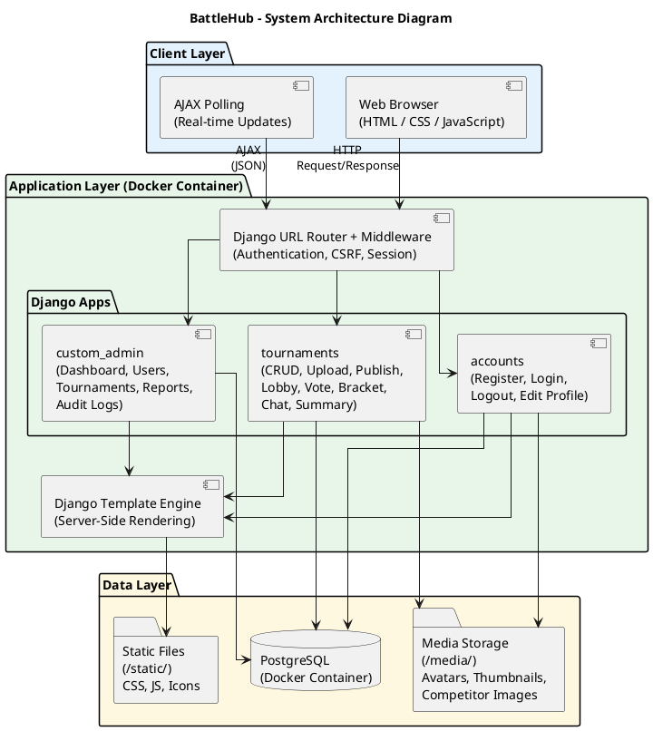

# BattleHub — System Architecture Diagram (PlantUML)

ก็อปไปวางที่ [plantuml.com](https://www.plantuml.com/plantuml/uml/) ได้เลย

---

```plantuml
@startuml BattleHub_System_Architecture

skinparam defaultFontName "Tahoma"
skinparam shadowing false
skinparam backgroundColor White
skinparam linetype ortho

title BattleHub - System Architecture Diagram

' ============================================================
'  Layer 1: Client
' ============================================================
package "Client Layer" as L1 #E3F2FD {
    [Web Browser\n(HTML / CSS / JavaScript)] as browser
    [AJAX Polling\n(Real-time Updates)] as ajax
}

' ============================================================
'  Layer 2: Web Server (Docker)
' ============================================================
package "Application Layer (Docker Container)" as L2 #E8F5E9 {

    [Django URL Router + Middleware\n(Authentication, CSRF, Session)] as router

    package "Django Apps" as apps {
        [accounts\n(Register, Login,\nLogout, Edit Profile)] as app1
        [tournaments\n(CRUD, Upload, Publish,\nLobby, Vote, Bracket,\nChat, Summary)] as app2
        [custom_admin\n(Dashboard, Users,\nTournaments, Reports,\nAudit Logs)] as app3
    }

    [Django Template Engine\n(Server-Side Rendering)] as templates
}

' ============================================================
'  Layer 3: Data
' ============================================================
package "Data Layer" as L3 #FFF8E1 {
    database "PostgreSQL\n(Docker Container)" as db
    folder "Media Storage\n(/media/)\nAvatars, Thumbnails,\nCompetitor Images" as media
    folder "Static Files\n(/static/)\nCSS, JS, Icons" as static
}

' ============================================================
'  Connections (top to bottom, no crossing)
' ============================================================
browser --> router : HTTP\nRequest/Response
ajax --> router : AJAX\n(JSON)

router --> app1
router --> app2
router --> app3

app1 --> templates
app2 --> templates
app3 --> templates

app1 --> db
app2 --> db
app3 --> db

app1 --> media
app2 --> media

templates --> static

@enduml
```
