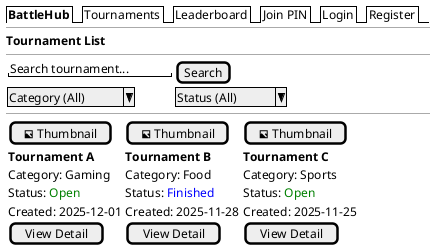
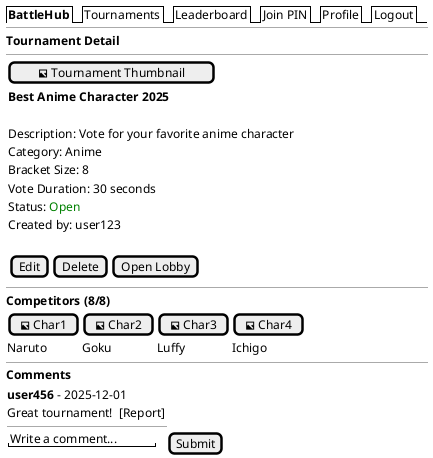
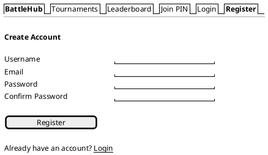
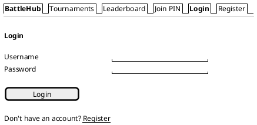
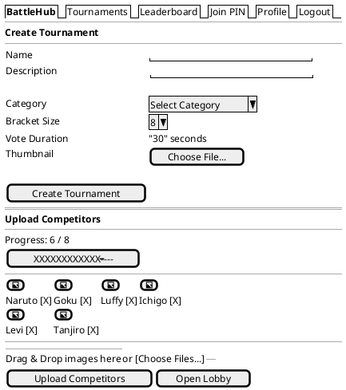
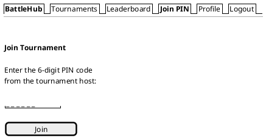
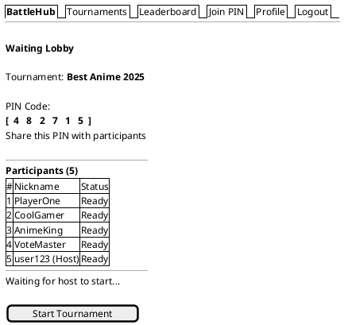
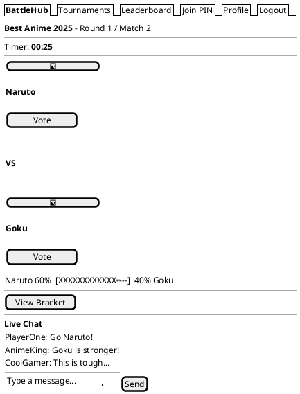
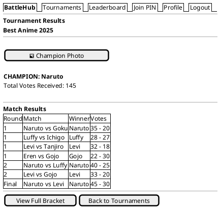
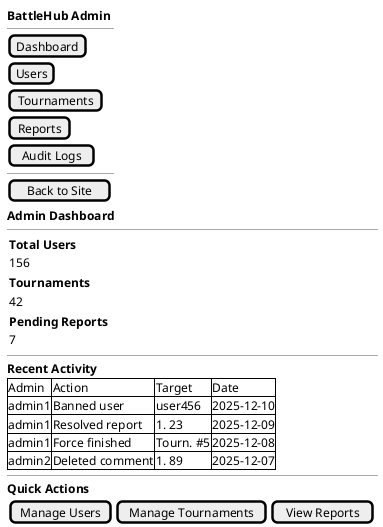

# 3.3 การออกแบบหน้าจอ (Screen Design)

การออกแบบหน้าจอของระบบ BattleHub ถูกจัดทำขึ้นในรูปแบบ Wireframe เพื่อแสดงโครงสร้างและองค์ประกอบของส่วนต่อประสานกับผู้ใช้งาน (User Interface) โดยนำเสนอเฉพาะหน้าจอหลักที่ผู้ใช้งานมีปฏิสัมพันธ์โดยตรง ดังนี้

---

## 3.3.1 หน้ารายการทัวร์นาเมนต์ (Tournament List Page)

(รูปที่ 3.1 Wireframe หน้ารายการทัวร์นาเมนต์)

คำอธิบายภาพ: จากภาพที่ 3.1 แสดง Wireframe ของหน้ารายการทัวร์นาเมนต์ ซึ่งเป็นหน้าแรกของระบบ BattleHub โดยแบ่งโครงสร้างหน้าจอออกเป็น 3 ส่วนหลัก ดังนี้ ส่วนบนสุดเป็นแถบนำทาง (Navbar) ประกอบด้วยเมนูสำหรับเข้าถึงหน้าต่าง ๆ ได้แก่ Tournaments, Leaderboard, Join PIN รวมถึงปุ่ม Login และ Register สำหรับผู้เยี่ยมชม ส่วนถัดมาเป็นพื้นที่ค้นหาและตัวกรอง (Search & Filter) ประกอบด้วยช่องค้นหาด้วยคำ Dropdown สำหรับเลือกหมวดหมู่ และ Dropdown สำหรับเลือกสถานะ เพื่อให้ผู้ใช้งานสามารถค้นหาทัวร์นาเมนต์ที่ต้องการได้อย่างรวดเร็ว ส่วนหลักแสดงรายการทัวร์นาเมนต์ในรูปแบบการ์ด (Card Layout) โดยแต่ละการ์ดประกอบด้วยรูปปก ชื่อทัวร์นาเมนต์ หมวดหมู่ สถานะ วันที่สร้าง และปุ่ม "View Detail" สำหรับเข้าถึงหน้ารายละเอียด

---

## 3.3.2 หน้ารายละเอียดทัวร์นาเมนต์ (Tournament Detail Page)

(รูปที่ 3.2 Wireframe หน้ารายละเอียดทัวร์นาเมนต์)

คำอธิบายภาพ: จากภาพที่ 3.2 แสดง Wireframe ของหน้ารายละเอียดทัวร์นาเมนต์ ซึ่งเป็นหน้าจอศูนย์กลางข้อมูลของทัวร์นาเมนต์แต่ละรายการ โดยแบ่งออกเป็น 3 ส่วนหลัก ดังนี้ ส่วนบนแสดงข้อมูลทั่วไปของทัวร์นาเมนต์ ประกอบด้วยรูปปก (Thumbnail) ทางด้านซ้าย และรายละเอียดทางด้านขวา ได้แก่ ชื่อ คำอธิบาย หมวดหมู่ ขนาด Bracket ระยะเวลาโหวต สถานะ และชื่อผู้สร้าง หากผู้ใช้งานเป็นเจ้าของทัวร์นาเมนต์ ปุ่มจัดการ (Edit, Delete, Open Lobby) จะถูกแสดงผลเพิ่มเติม ส่วนกลางแสดงรายชื่อผู้เข้าแข่งขัน (Competitors) พร้อมรูปภาพ โดยแสดงจำนวนปัจจุบันเทียบกับจำนวนที่กำหนด ส่วนล่างเป็นพื้นที่ความคิดเห็น (Comments) ผู้ใช้งานสามารถพิมพ์ความคิดเห็น กดปุ่ม Submit เพื่อส่ง และกดปุ่ม Report เพื่อรายงานความคิดเห็นที่ไม่เหมาะสมได้

---

## 3.3.3 หน้าสมัครสมาชิก (Register Page)

(รูปที่ 3.3 Wireframe หน้าสมัครสมาชิก)

คำอธิบายภาพ: จากภาพที่ 3.3 แสดง Wireframe ของหน้าสมัครสมาชิก ซึ่งออกแบบให้เรียบง่ายและเน้นการใช้งานเป็นหลัก ตรงกลางหน้าจอประกอบด้วยแบบฟอร์มลงทะเบียน 4 ช่อง ได้แก่ ชื่อผู้ใช้ (Username) อีเมล (Email) รหัสผ่าน (Password) และยืนยันรหัสผ่าน (Confirm Password) ด้านล่างของแบบฟอร์มมีปุ่ม "Register" สำหรับยืนยันการสมัคร เมื่อกรอกข้อมูลครบถ้วนและข้อมูลผ่านการตรวจสอบความถูกต้อง ระบบจะสร้างบัญชีผู้ใช้และนำส่งไปยังหน้าเข้าสู่ระบบ นอกจากนี้ยังมีลิงก์ "Login" สำหรับผู้ที่มีบัญชีอยู่แล้วเพื่อดำเนินการเข้าสู่ระบบได้โดยตรง

---

## 3.3.4 หน้าเข้าสู่ระบบ (Login Page)

(รูปที่ 3.4 Wireframe หน้าเข้าสู่ระบบ)

คำอธิบายภาพ: จากภาพที่ 3.4 แสดง Wireframe ของหน้าเข้าสู่ระบบ ประกอบด้วยแบบฟอร์มสำหรับกรอกชื่อผู้ใช้ (Username) และรหัสผ่าน (Password) ด้านล่างมีปุ่ม "Login" สำหรับยืนยันการเข้าสู่ระบบ เมื่อข้อมูลถูกส่งไปยังเซิร์ฟเวอร์ ระบบจะดำเนินการตรวจสอบข้อมูลยืนยันตัวตน (Authentication) และตรวจสอบสถานะบัญชี หากข้อมูลถูกต้องและบัญชีไม่ถูกระงับ ระบบจะสร้าง Session และนำส่งผู้ใช้งานไปยังหน้ารายการทัวร์นาเมนต์ในสถานะสมาชิก หากข้อมูลไม่ถูกต้องหรือบัญชีถูกระงับ ข้อความแจ้งเตือนที่เหมาะสมจะถูกแสดงผลในส่วนแบบฟอร์ม ด้านล่างสุดมีลิงก์ "Register" สำหรับผู้ที่ยังไม่มีบัญชีเพื่อดำเนินการสมัครสมาชิก

---

## 3.3.5 หน้าสร้างทัวร์นาเมนต์และอัปโหลดผู้เข้าแข่งขัน (Create Tournament & Upload Competitors)

(รูปที่ 3.5 Wireframe หน้าสร้างทัวร์นาเมนต์และอัปโหลดผู้เข้าแข่งขัน)

คำอธิบายภาพ: จากภาพที่ 3.5 แสดง Wireframe ของหน้าสร้างทัวร์นาเมนต์และอัปโหลดผู้เข้าแข่งขัน ซึ่งเป็น 2 ขั้นตอนที่ต่อเนื่องกันในกระบวนการสร้างทัวร์นาเมนต์ ส่วนบนเป็นแบบฟอร์มสร้างทัวร์นาเมนต์ ประกอบด้วย ช่องกรอกชื่อทัวร์นาเมนต์ ช่องกรอกคำอธิบาย Dropdown สำหรับเลือกหมวดหมู่ Dropdown สำหรับเลือกขนาด Bracket (2, 4, 8 หรือ 16 คน) ช่องกำหนดระยะเวลาโหวต (วินาที) และปุ่มอัปโหลดรูปปก เมื่อกดปุ่ม "Create Tournament" ทัวร์นาเมนต์จะถูกสร้างในสถานะ "Draft" ส่วนล่างเป็นหน้าอัปโหลดผู้เข้าแข่งขัน แสดง Progress Bar สำหรับติดตามจำนวนปัจจุบันเทียบกับจำนวนที่ต้องการ รายการผู้เข้าแข่งขันที่อัปโหลดแล้วพร้อมปุ่มลบ (X) สำหรับลบรายการ พื้นที่ลากวาง (Drag & Drop) สำหรับอัปโหลดรูปภาพ ปุ่ม "Upload Competitors" สำหรับยืนยันการอัปโหลด และปุ่ม "Open Lobby" ที่จะแสดงผลเมื่อจำนวนผู้เข้าแข่งขันครบตามขนาด Bracket Size ที่กำหนด

---

## 3.3.6 หน้าเข้าร่วมด้วย PIN (Join via PIN Page)

(รูปที่ 3.6 Wireframe หน้าเข้าร่วมทัวร์นาเมนต์ผ่านรหัส PIN)

คำอธิบายภาพ: จากภาพที่ 3.6 แสดง Wireframe ของหน้าเข้าร่วมทัวร์นาเมนต์ผ่านรหัส PIN ซึ่งเป็นฟีเจอร์หลักของระบบที่ได้รับแรงบันดาลใจจาก Kahoot ออกแบบให้เรียบง่ายและเป็นศูนย์กลางหน้าจอ ประกอบด้วยข้อความคำแนะนำ "Enter the 6-digit PIN code from the tournament host" ช่องกรอกรหัส PIN 6 หลัก และปุ่ม "Join" สำหรับยืนยันการเข้าร่วม เมื่อผู้ใช้งานกรอกรหัส PIN และกดปุ่ม Join ระบบจะดำเนินการตรวจสอบรหัสกับฐานข้อมูล หากรหัสถูกต้องและทัวร์นาเมนต์อยู่ในสถานะ "Waiting" ผู้ใช้งานจะถูกนำส่งไปยังหน้ากรอกชื่อเล่น หากรหัสไม่ถูกต้องข้อความแจ้งเตือนจะถูกแสดงผล

---

## 3.3.7 หน้าห้องพักรอ (Waiting Lobby Page)

(รูปที่ 3.7 Wireframe หน้าห้องพักรอ)

คำอธิบายภาพ: จากภาพที่ 3.7 แสดง Wireframe ของหน้าห้องพักรอ (Waiting Lobby) ซึ่งเป็นหน้าจอที่ผู้เข้าร่วมทุกคนจะเห็นหลังจากกรอกชื่อเล่นเรียบร้อยแล้ว โดยแบ่งออกเป็น 3 ส่วนหลัก ดังนี้ ส่วนบนแสดงชื่อทัวร์นาเมนต์และรหัส PIN 6 หลักอย่างเด่นชัด เพื่อให้เจ้าของทัวร์นาเมนต์สามารถแจกจ่ายรหัส PIN ให้ผู้เข้าร่วมคนอื่นได้สะดวก ส่วนกลางแสดงตารางรายชื่อผู้เข้าร่วม (Participants) ที่อัปเดตข้อมูลแบบ Real-time ทุก ๆ 3 วินาทีผ่าน AJAX Polling เมื่อมีผู้เข้าร่วมใหม่เข้ามา ชื่อจะถูกแสดงผลในตารางโดยอัตโนมัติ ส่วนล่างแสดงข้อความ "Waiting for host to start..." สำหรับผู้เข้าร่วมทั่วไป และปุ่ม "Start Tournament" ที่แสดงเฉพาะสำหรับเจ้าของทัวร์นาเมนต์เท่านั้น เมื่อเจ้าของกดปุ่มเริ่ม ผู้เข้าร่วมทุกคนจะถูกนำส่งไปยังหน้าโหวตโดยอัตโนมัติ

---

## 3.3.8 หน้าโหวต (Play / Vote Page)

(รูปที่ 3.8 Wireframe หน้าโหวต)

คำอธิบายภาพ: จากภาพที่ 3.8 แสดง Wireframe ของหน้าโหวต ซึ่งเป็นหน้าจอที่สำคัญที่สุดของระบบ BattleHub เนื่องจากเป็นพื้นที่ที่ผู้เข้าร่วมดำเนินกิจกรรมหลักของระบบ โดยแบ่งออกเป็น 5 ส่วนหลัก ดังนี้ ส่วนบนสุดแสดงชื่อทัวร์นาเมนต์ รอบการแข่งขัน (Round) และลำดับแมตช์ (Match) ถัดมาเป็นตัวนับเวลาถอยหลัง (Countdown Timer) ที่แสดงเวลาคงเหลือสำหรับการโหวตในแมตช์ปัจจุบัน ส่วนกลางเป็นพื้นที่หลักแสดงรูปภาพและชื่อของผู้เข้าแข่งขัน 2 คนที่กำลังแข่งขันพร้อมปุ่ม "Vote" สำหรับลงคะแนน ด้านล่างแสดงแถบเปอร์เซ็นต์คะแนนโหวต (Vote Bar) ที่อัปเดตแบบ Real-time เพื่อให้ผู้เข้าร่วมเห็นสัดส่วนคะแนนขณะโหวต และปุ่ม "View Bracket" สำหรับดูสายการแข่งขัน ส่วนล่างสุดเป็นพื้นที่แชทสด (Live Chat) สำหรับสื่อสารระหว่างผู้เข้าร่วมในระหว่างการแข่งขัน ประกอบด้วยพื้นที่แสดงข้อความ ช่องพิมพ์ข้อความ และปุ่ม "Send"

---

## 3.3.9 หน้าสรุปผลการแข่งขัน (Summary / Results Page)

(รูปที่ 3.9 Wireframe หน้าสรุปผลการแข่งขัน)

คำอธิบายภาพ: จากภาพที่ 3.9 แสดง Wireframe ของหน้าสรุปผลการแข่งขัน ซึ่งถูกแสดงผลโดยอัตโนมัติเมื่อทัวร์นาเมนต์ดำเนินการจนครบทุกรอบและเสร็จสิ้น โดยแบ่งออกเป็น 3 ส่วนหลัก ดังนี้ ส่วนบนแสดงรูปภาพและชื่อของผู้ชนะเลิศ (Champion) พร้อมจำนวนคะแนนโหวตรวมทั้งหมดที่ได้รับตลอดการแข่งขัน ส่วนกลางแสดงตารางผลการแข่งขันทุกรอบ โดยแต่ละแถวประกอบด้วย รอบ คู่แข่งขัน ผู้ชนะ และคะแนนโหวตของทั้งสองฝ่าย เพื่อให้ผู้ใช้งานสามารถทบทวนผลของทุกแมตช์ได้โดยละเอียด ส่วนล่างมีปุ่ม "View Full Bracket" สำหรับดูสายการแข่งขันเต็มในรูปแบบแผนผังต้นไม้ และปุ่ม "Back to Tournaments" สำหรับกลับไปยังหน้ารายการทัวร์นาเมนต์

---

## 3.3.10 หน้าแดชบอร์ดผู้ดูแลระบบ (Admin Dashboard Page)

(รูปที่ 3.10 Wireframe หน้าแดชบอร์ดผู้ดูแลระบบ)

คำอธิบายภาพ: จากภาพที่ 3.10 แสดง Wireframe ของหน้าแดชบอร์ดผู้ดูแลระบบ (Admin Dashboard) ซึ่งเป็นหน้าจอหลักของ Admin Panel ที่เข้าถึงได้เฉพาะผู้ดูแลระบบ (is_staff = true) เท่านั้น โดยจัดวาง Layout ในรูปแบบ 2 คอลัมน์ ดังนี้ ด้านซ้ายเป็นแถบเมนูด้านข้าง (Sidebar Navigation) สำหรับเข้าถึงส่วนจัดการต่าง ๆ ได้แก่ Dashboard สำหรับดูภาพรวม Users สำหรับจัดการผู้ใช้งาน Tournaments สำหรับจัดการทัวร์นาเมนต์ Reports สำหรับจัดการรายงานปัญหา Audit Logs สำหรับตรวจสอบประวัติการดำเนินการ และปุ่ม "Back to Site" สำหรับกลับไปยังหน้าเว็บไซต์หลัก ด้านขวาเป็นพื้นที่เนื้อหาหลัก แบ่งเป็น 3 ส่วน ส่วนบนแสดงการ์ดสรุปสถิติ (Stats Cards) ประกอบด้วยจำนวนผู้ใช้งานทั้งหมด จำนวนทัวร์นาเมนต์ และจำนวนรายงานที่รอดำเนินการ ส่วนกลางแสดงตารางกิจกรรมล่าสุด (Recent Activity) จาก Audit Log ส่วนล่างมีปุ่มลัด (Quick Actions) สำหรับเข้าถึงหน้าจัดการหลักได้โดยตรง
