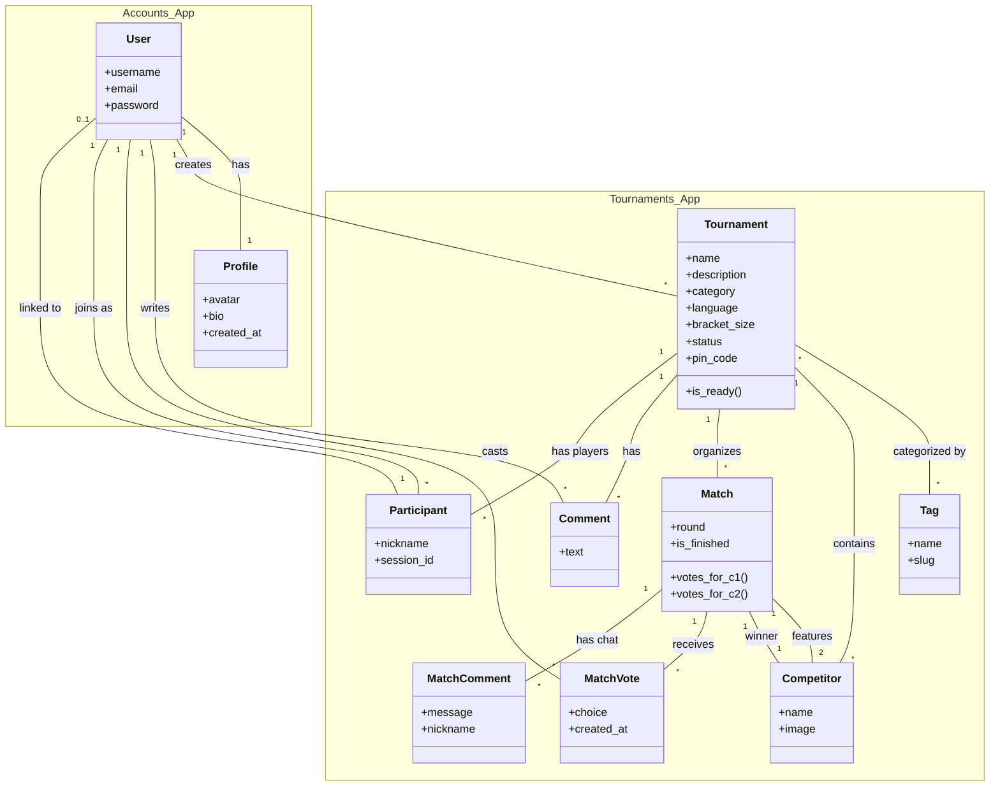
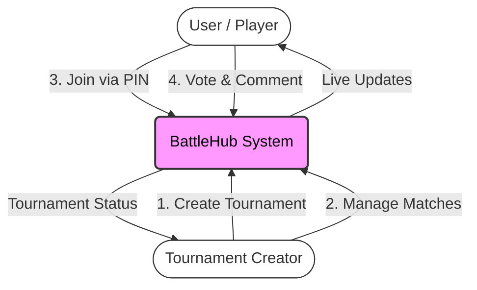
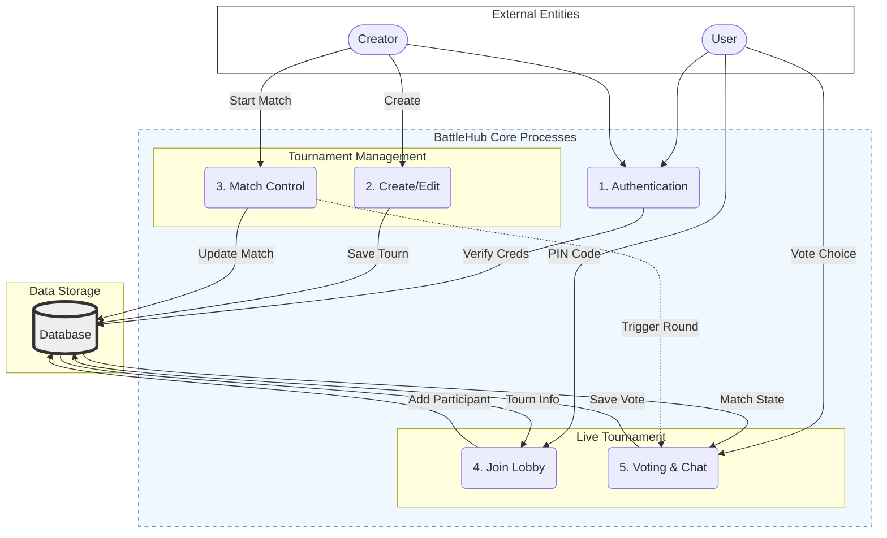

# Lab 3: Design Diagrams (BattleHub)

This document contains the Class Diagram and Data Flow Diagrams (DFD) for the BattleHub project.

## 1. Class Diagram

This diagram represents the database schema and relationships between models, grouped by their respective Django Apps.

## 2. Data Flow Diagram (DFD)

### Level 0: Context Diagram

Overview of the system and its interactions with external entities.

### Level 1: System Processes

Detailed breakdown with clear separation of layers to minimize overlapping lines.

### Note
- **Design Improvement**: Uses Top-Down (TD) layout with subgraphs to organize the flow from Actors down to the Database, reducing intersecting lines.
